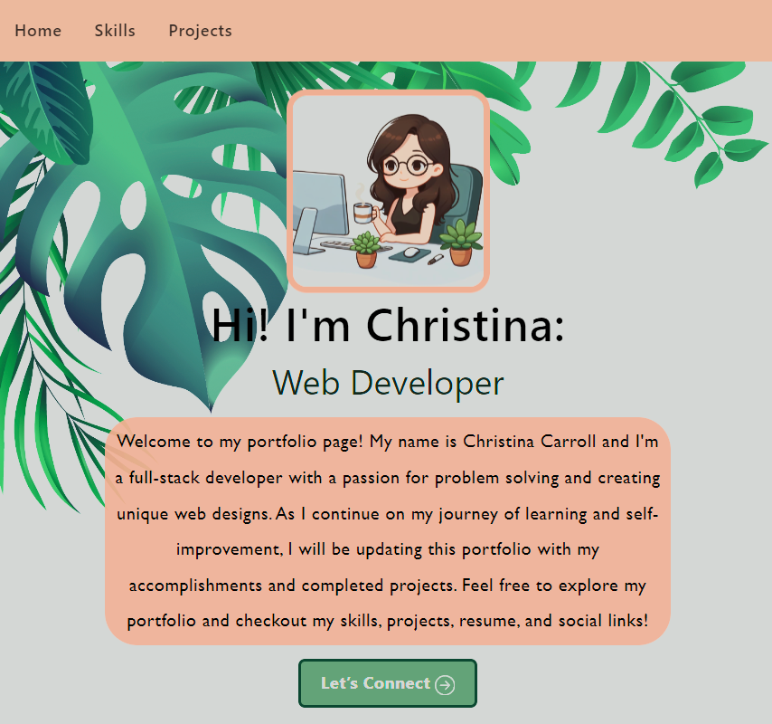

# Title: React Professional Portfolio 

## Table of Contents
- [Description](#description)
- [Technology](#technology)
- [Usage](#installation/usage)
- [Contribution](#contribution)
- [Questions](#questions)

## Description
In this project, I created a portfolio page using React/Vite that showcases my skills and projects as a full stack developer. It also features a contact form, social media links, and a downloadable resume for potential employer's convenience. 

### Deployed Application on Netlify
https://christinacarrollportfolio.netlify.app/ 

### Screenshot of Application

### Technology
- Node.js
- React/Vite

## Usage
- Clone the repository and enter `npm install` in the command line to install all dependencies
- Enter `npm run dev` in the command-line to build and start the application on your localhost server

## Contribution
- Fork the repository

## Questions
Contact me with questions: 
- https://github.com/ccarroll929 
- ccarroll0528@gmail.com

